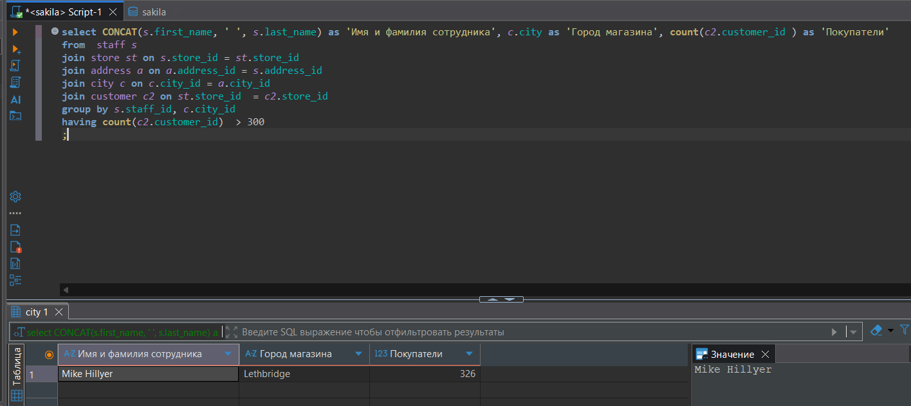
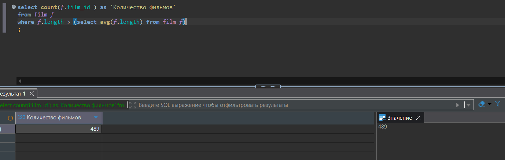
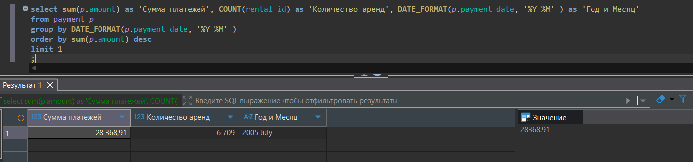

# Домашнее задание к занятию "SQL. Часть 2" - Tarkov Viktor


### Инструкция по выполнению домашнего задания

   1. Сделайте `fork` данного репозитория к себе в Github и переименуйте его по названию или номеру занятия, например, https://github.com/имя-вашего-репозитория/git-hw или  https://github.com/имя-вашего-репозитория/7-1-ansible-hw).
   2. Выполните клонирование данного репозитория к себе на ПК с помощью команды `git clone`.
   3. Выполните домашнее задание и заполните у себя локально этот файл README.md:
      - впишите вверху название занятия и вашу фамилию и имя
      - в каждом задании добавьте решение в требуемом виде (текст/код/скриншоты/ссылка)
      - для корректного добавления скриншотов воспользуйтесь [инструкцией "Как вставить скриншот в шаблон с решением](https://github.com/netology-code/sys-pattern-homework/blob/main/screen-instruction.md)
      - при оформлении используйте возможности языка разметки md (коротко об этом можно посмотреть в [инструкции  по MarkDown](https://github.com/netology-code/sys-pattern-homework/blob/main/md-instruction.md))
   4. После завершения работы над домашним заданием сделайте коммит (`git commit -m "comment"`) и отправьте его на Github (`git push origin`);
   5. Для проверки домашнего задания преподавателем в личном кабинете прикрепите и отправьте ссылку на решение в виде md-файла в вашем Github.
   6. Любые вопросы по выполнению заданий спрашивайте в чате учебной группы и/или в разделе “Вопросы по заданию” в личном кабинете.
   
Желаем успехов в выполнении домашнего задания!
   
### Дополнительные материалы, которые могут быть полезны для выполнения задания

1. [Руководство по оформлению Markdown файлов](https://gist.github.com/Jekins/2bf2d0638163f1294637#Code)

---

Задание можно выполнить как в любом IDE, так и в командной строке.

### Задание 1

Одним запросом получите информацию о магазине, в котором обслуживается более 300 покупателей, и выведите в результат следующую информацию:

   - фамилия и имя сотрудника из этого магазина;
   - город нахождения магазина;
   - количество пользователей, закреплённых в этом магазине.

```python
select CONCAT(s.first_name, ' ', s.last_name) as 'Имя и фамилия сотрудника', c.city as 'Город магазина', count(c2.customer_id ) as 'Покупатели'
from  staff s 
join store st on s.store_id = st.store_id 
join address a on a.address_id = s.address_id
join city c on c.city_id = a.city_id
join customer c2 on st.store_id  = c2.store_id
group by s.staff_id, c.city_id
having count(c2.customer_id)  > 300
;
```



---

### Задание 2

Получите количество фильмов, продолжительность которых больше средней продолжительности всех фильмов.

```python
select count(f.film_id ) as 'Количество фильмов'
from film f 
where f.length > (select avg(f.length) from film f)
;
```



---

### Задание 3

Получите информацию, за какой месяц была получена наибольшая сумма платежей, и добавьте информацию по количеству аренд за этот месяц.

```python
select sum(p.amount) as 'Сумма платежей', COUNT(rental_id) as 'Количество аренд', DATE_FORMAT(p.payment_date, '%Y %M' ) as 'Год и Месяц'
from payment p
group by DATE_FORMAT(p.payment_date, '%Y %M')
order by sum(p.amount) desc
limit 1
;
```



---
